# PartsHub – Database Design (ERD)

This document describes the database schema of **PartsHub**, a marketplace for buying and selling PC hardware, and every Eloquent relationship used in the project. The design also models **technical specifications** and **compatibility** between components (for example CPU socket vs motherboard socket).

## 1. Entity Relationship Diagram

```mermaid
erDiagram
    USERS ||--o| PROFILES : "has one"
    USERS ||--o{ ADDRESSES : "saves"
    USERS ||--o{ PRODUCTS : "sells"
    USERS ||--o{ ORDERS : "places"
    USERS ||--o{ REVIEWS : "writes"

    CATEGORIES ||--o{ PRODUCTS : "groups"
    BRANDS ||--o{ PRODUCTS : "makes"
    PRODUCTS ||--o{ PRODUCT_IMAGES : "has"
    PRODUCTS ||--o{ REVIEWS : "receives"

    PRODUCTS ||--o{ PRODUCT_TAG : "tagged via"
    TAGS ||--o{ PRODUCT_TAG : "labels"

    CATEGORIES ||--o{ SPECIFICATION_TYPES : "defines"
    PRODUCTS ||--o{ PRODUCT_SPECIFICATIONS : "described by"
    SPECIFICATION_TYPES ||--o{ PRODUCT_SPECIFICATIONS : "describes"

    COMPATIBILITY_TYPES ||--o{ COMPATIBILITY_RULES : "governs"
    CATEGORIES ||--o{ COMPATIBILITY_RULES : "source category"
    CATEGORIES ||--o{ COMPATIBILITY_RULES : "target category"
    SPECIFICATION_TYPES ||--o{ COMPATIBILITY_RULES : "source spec"
    SPECIFICATION_TYPES ||--o{ COMPATIBILITY_RULES : "target spec"

    COMPATIBILITY_TYPES ||--o{ COMPATIBILITIES : "classifies"
    PRODUCTS ||--o{ COMPATIBILITIES : "source product"
    PRODUCTS ||--o{ COMPATIBILITIES : "target product"

    ORDERS ||--o{ ORDER_ITEMS : "contains"
    PRODUCTS ||--o{ ORDER_ITEMS : "ordered via"
    ORDERS ||--o| PAYMENTS : "paid by"
    ADDRESSES ||--o{ ORDERS : "ships to"

    USERS {
        bigint id PK
        string name
        string email UK
        string password
        string role "buyer, seller, admin"
    }

    PROFILES {
        bigint id PK
        bigint user_id FK "unique"
        string phone
        string avatar
        string store_name "nullable, sellers only"
        text bio
    }

    ADDRESSES {
        bigint id PK
        bigint user_id FK
        string label
        string recipient_name
        string phone
        string address_line
        string city
        string province
        string postal_code
        boolean is_default
    }

    CATEGORIES {
        bigint id PK
        string name
        string slug UK
        string icon
    }

    BRANDS {
        bigint id PK
        string name
        string slug UK
        string logo
    }

    PRODUCTS {
        bigint id PK
        bigint seller_id FK "users.id"
        bigint category_id FK
        bigint brand_id FK
        string name
        string slug UK
        string sku UK
        text description
        decimal price
        int stock
        string condition "new, used"
        int warranty_months
        boolean is_active
    }

    PRODUCT_IMAGES {
        bigint id PK
        bigint product_id FK
        string path
        boolean is_primary
        int sort_order
    }

    TAGS {
        bigint id PK
        string name UK
    }

    PRODUCT_TAG {
        bigint product_id FK
        bigint tag_id FK
    }

    SPECIFICATION_TYPES {
        bigint id PK
        bigint category_id FK
        string name
        string slug "unique per category"
        string unit "nullable, e.g. GHz, GB, W"
        string data_type "string, number, boolean"
        boolean is_filterable
    }

    PRODUCT_SPECIFICATIONS {
        bigint product_id FK
        bigint specification_type_id FK
        string value
    }

    COMPATIBILITY_TYPES {
        bigint id PK
        string name
        string slug UK
        text description
    }

    COMPATIBILITY_RULES {
        bigint id PK
        bigint compatibility_type_id FK
        bigint source_category_id FK "categories.id"
        bigint target_category_id FK "categories.id"
        bigint source_spec_type_id FK "specification_types.id"
        bigint target_spec_type_id FK "specification_types.id"
        string operator "equals, contains, gte, lte"
        string description
    }

    COMPATIBILITIES {
        bigint id PK
        bigint product_id FK "source product"
        bigint compatible_product_id FK "target product"
        bigint compatibility_type_id FK
        string status "compatible, partial, incompatible"
        string note "nullable"
    }

    ORDERS {
        bigint id PK
        bigint user_id FK "buyer"
        bigint shipping_address_id FK
        string order_number UK
        string status "pending, paid, shipped, completed, cancelled"
        decimal shipping_cost
        decimal total_amount
        timestamp ordered_at
    }

    ORDER_ITEMS {
        bigint order_id FK
        bigint product_id FK
        int quantity
        decimal unit_price
        decimal subtotal
    }

    PAYMENTS {
        bigint id PK
        bigint order_id FK "unique"
        string method "transfer, e-wallet, cod"
        string status "pending, paid, failed"
        decimal amount
        string reference "nullable"
        timestamp paid_at "nullable"
    }

    REVIEWS {
        bigint id PK
        bigint user_id FK
        bigint product_id FK
        tinyint rating "1-5"
        text comment
    }
```

## 2. Relationship Summary

| Type | Relationship | Eloquent |
| --- | --- | --- |
| One-to-One | `User` ↔ `Profile` | `hasOne` / `belongsTo` |
| One-to-One | `Order` ↔ `Payment` | `hasOne` / `belongsTo` |
| One-to-Many | `User` → `Address` | `hasMany` / `belongsTo` |
| One-to-Many | `User` (seller) → `Product` | `hasMany` / `belongsTo` |
| One-to-Many | `User` (buyer) → `Order` | `hasMany` / `belongsTo` |
| One-to-Many | `User` → `Review` | `hasMany` / `belongsTo` |
| One-to-Many | `Category` → `Product` | `hasMany` / `belongsTo` |
| One-to-Many | `Brand` → `Product` | `hasMany` / `belongsTo` |
| One-to-Many | `Product` → `ProductImage` | `hasMany` / `belongsTo` |
| One-to-Many | `Product` → `Review` | `hasMany` / `belongsTo` |
| One-to-Many | `Category` → `SpecificationType` | `hasMany` / `belongsTo` |
| One-to-Many | `CompatibilityType` → `CompatibilityRule` | `hasMany` / `belongsTo` |
| One-to-Many | `Address` → `Order` | `hasMany` / `belongsTo` |
| Many-to-Many | `Product` ↔ `Tag` (pivot `product_tag`) | `belongsToMany` |
| Many-to-Many + pivot data | `Product` ↔ `SpecificationType` (pivot `product_specifications`, column `value`) | `belongsToMany` + `withPivot` |
| Many-to-Many + pivot data | `Order` ↔ `Product` (pivot `order_items`, columns `quantity`, `unit_price`, `subtotal`) | `belongsToMany` + `withPivot` |
| Many-to-Many + pivot data (self-referencing) | `Product` ↔ `Product` (pivot `compatibilities`, columns `compatibility_type_id`, `status`, `note`) | `belongsToMany` + `withPivot` |
| Has-Many-Through | `Category` → `OrderItem` through `Product` | `hasManyThrough` |
| Has-Many-Through | `User` (seller) → `OrderItem` through `Product` | `hasManyThrough` |
| Has-Many-Through | `Category` → `Review` through `Product` | `hasManyThrough` |

## 3. Seeded Data

### Categories

| Name | Slug |
| --- | --- |
| Processor | `processor` |
| Motherboard | `motherboard` |
| Memory (RAM) | `memory` |
| Graphics Card | `graphics-card` |
| Storage | `storage` |
| Power Supply | `power-supply` |
| Casing | `casing` |
| CPU Cooler | `cpu-cooler` |

### Specification types (examples per category)

| Category | Specification types |
| --- | --- |
| Processor | Socket, Cores, Threads, Base Clock (GHz), TDP (W) |
| Motherboard | Socket, Chipset, RAM Type, RAM Slots, Form Factor, PCIe Version |
| Memory (RAM) | Type (DDR4/DDR5), Capacity (GB), Speed (MHz) |
| Graphics Card | VRAM (GB), Length (mm), TDP (W), Power Connector |
| Storage | Interface (SATA/NVMe), Capacity (GB), Form Factor |
| Power Supply | Wattage (W), Efficiency Rating, Modular |
| Casing | Supported Form Factor, Max GPU Length (mm) |
| CPU Cooler | Supported Sockets, TDP Rating (W), Height (mm) |

### Compatibility types

| Name | Slug | Rule example |
| --- | --- | --- |
| CPU – Motherboard Socket | `cpu-motherboard-socket` | `processor.Socket` equals `motherboard.Socket` |
| RAM – Motherboard Type | `ram-motherboard-type` | `memory.Type` equals `motherboard.RAM Type` |
| Motherboard – Casing Form Factor | `motherboard-casing-form-factor` | `casing.Supported Form Factor` contains `motherboard.Form Factor` |
| GPU – Casing Length | `gpu-casing-length` | `casing.Max GPU Length` gte `graphics-card.Length` |
| CPU Cooler – CPU Socket | `cooler-cpu-socket` | `cpu-cooler.Supported Sockets` contains `processor.Socket` |
| PSU – Power Requirement | `psu-power-requirement` | `power-supply.Wattage` gte `graphics-card.TDP` |

## 4. Design Notes

- **Unique constraints:** `users.email`, `profiles.user_id`, `categories.slug`, `brands.slug`, `products.slug`, `products.sku`, `tags.name`, `compatibility_types.slug`, `orders.order_number`, `payments.order_id`, and the pairs (`product_tag.product_id`, `product_tag.tag_id`), (`product_specifications.product_id`, `product_specifications.specification_type_id`), (`order_items.order_id`, `order_items.product_id`), (`reviews.user_id`, `reviews.product_id`), (`specification_types.category_id`, `specification_types.slug`).
- **Flexible specifications:** instead of one wide `products` table with a column for every possible spec, each category defines its own `specification_types`, and `product_specifications` stores the value per product. A new component type needs only new rows, not a new migration.
- **Two ways to express compatibility:** `compatibility_rules` describe the logic between categories (which specs are compared and how), while `compatibilities` stores concrete product pairs with a `status`. Rules can be used to generate the pairs, and admins can still override a single pair manually.
- **Self-referencing pivot:** `compatibilities` links `products` to `products`, so the `Product` model has a `compatibleProducts()` relation using `belongsToMany(Product::class, 'compatibilities', 'product_id', 'compatible_product_id')`.
- **Price snapshot:** `order_items.unit_price` copies the product price at purchase time, so old orders keep their original price even if the product price changes later.
- **Seller vs buyer:** both are rows in `users`, separated by `users.role`. `products.seller_id` and `orders.user_id` both point to `users.id`.
- **Cascade rules:** deleting a user cascades to their profile, addresses, and reviews. Deleting a product cascades to its images, tag links, and specification values. Deleting a category or brand is restricted while products still use it. Products and orders that appear in `order_items` are restricted from deletion to keep order history intact.
- **Derived values:** product average rating and order totals can be computed from `reviews` and `order_items`.
